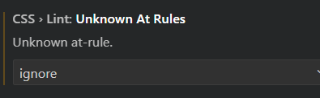

# React Single-Page-Application Template

This was created with VSCode users in mind.

### Usage

Pull or fork the repository
- Install dependancies
  ```
  npm i
  ```
- Run
  ```
  npm run dev
  ```

### Pre-requisites

#### Vite
- Vite requires [Node.js](https://vitejs.dev/guide/) version 18+. 20+.

#### Eslint + Prettier
- eslint.cjs comes with Vite installation, but you need to install [Eslint](https://marketplace.visualstudio.com/items?itemName=dbaeumer.vscode-eslint) extension.
- Prettier extension is also available, allows you to set format on paste and format on save settings on VSCode settings.

#### Tailwind
- (Optional) nstall Tailwind CSS Intellisense extension
- Tailwind CSS-at rules can flag warnings, if you come across these so disable in VSCode 
